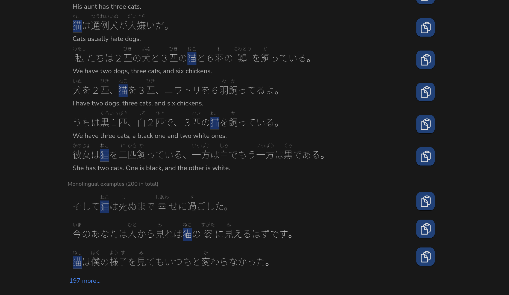

# jpdb.io tweaks



Simple tweaks for [jpdb.io](https://jpdb.io), a Japanese dictionary and spaced repetition system. **Adds copy markdown button to example sentences.** If jpdb.io makes breaking changes to their UI and this extension stops working, please open an issue!

Example output:

```
> あの\ **[猫]{ねこ}**\ は、[僕]{ぼく}の[横]{よこ}で[寝]{ね}るのが[好]{す}きなんだ。
> The cat likes to sleep beside me.
```

The [CommonMark specification for Markdown](https://spec.commonmark.org/0.31.2/) does not have an official syntax for furigana, so this extension copies furigana with my own custom syntax, where <ruby>漢<rp>(</rp><rt>かん</rt><rp>)</rp></ruby><ruby>字<rp>(</rp><rt>じ</rt><rp>)</rp></ruby> is formatted as `[漢]{かん}[字]{じ}`.

In order for it to render properly, you'll have to add this formatting to your website's rendering pipeline. This can be achieved using a simple regular expression. If you are using [Hugo](https://gohugo.io), add the following to your page template where you render the `.Content` of the page:

```GO
{{
    .Content
    | replaceRE `\[([^\]]*)\]{([^\}]*)}` `<ruby lang="ja">$1<rp>(</rp><rt>$2</rt><rp>)</rp></ruby>`
    | safeHTML
}}
```
